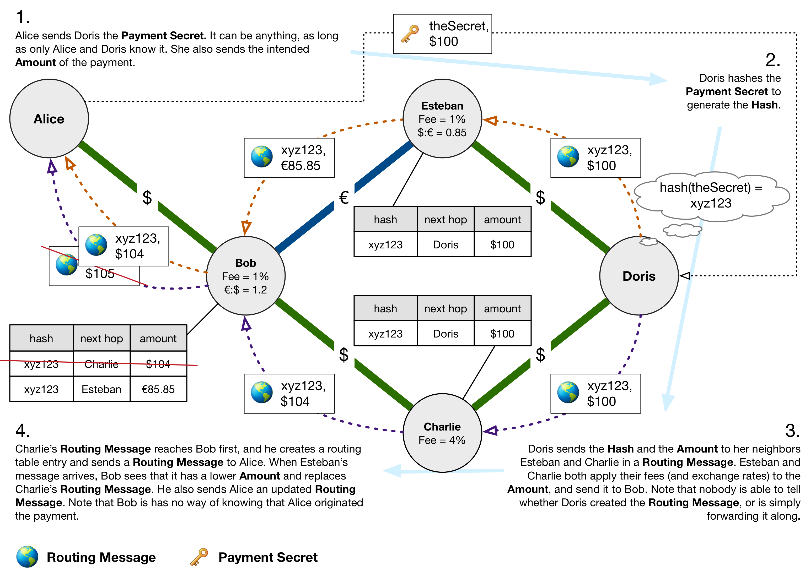
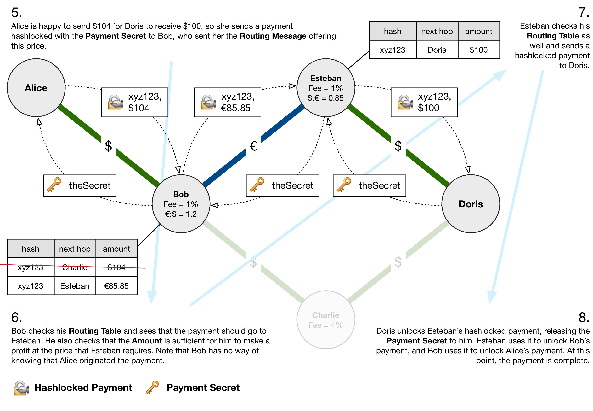

# Reactive Payment Routing

*To run a simulation of the protocol go to https://tonicdev.com/jehan/reactive-payment-routing, or go into `/demo` and type `npm start`, then go to localhost:4456 and open the console.*

If you're going to have a multihop payment network, you need some way to route payments. How does Alice know that Bob is the best person to go through to reach Charlie? Perhaps Benjamin also has channels open with Alice and Charlie but he charges a lower fee. There needs to be some way to find the lowest-priced route to a payment's destination. This problem is very similar to the problem of routing packets on the internet, so we will look at some possible solutions from that domain.

There are two main categories of ad-hoc routing protocols- proactive and reactive.

Proactive protocols work by exchanging messages to build up routing tables listing the next hop for each address on the network. When a node receives a packet, it is immediately able to forward it along to the best peer to get it closer to its destination. However, every node needs to have an entry in its routing tables for every other node. On a large network, this becomes infeasible.

In reactive protocols, nodes request a route from the network when they need to send packets to a new destination. This means that it is not necessary for every node to store information on every destination, and it is not necessary to update every node on the network when a connection changes. Of course, the downside is that the initial route discovery process adds some unavoidable latency when sending to new destinations.

For most paymsents, a few hundred milliseconds to establish a route is not a huge deal. Needing to store a routing table entry for every address in the network is far worse. For this reason we'll use a variation of AODV (citation), a reactive routing protocol.

In AODV, when nodes need to send a packet to a destination they have never sent packets to, they send out a **Route Request Message**, which is flooded through the network (with some optimizations). When the destination recieves this message, it sends a **Route Reply Message**. Intermediary nodes along the path cache the next hops for the source and the destination, thereby storing only the routing information they are likely to need often.

### Protocol

Since our nodes are presumed to already have connectivity, we can skip the **Route Request Message**. Our protocol has only one type of message, which we'll call the **Routing Message**. A node's neighbors are those nodes that it has payment channels open with.

When a node wishes to send a multihop payment, it first sends a **Payment Initialization** to the recipient.

----

*Sender to recipient*

- **Payment Initialization**
  - **Secret**: Payment secret.
  - **Amount**: Amount of payment.

----

The recipient then constructs a **Routing Message**. The routing message includes the hash of the payment secret, and the amount of the payment. It sends the **Routing Message** to all of its neighbors who have enough in their channels to cover the payment (if Dolores is trying to receive $100, she won't send the **Routing Message** to Clark, who only has $20 in his side of the channel).

If the recipient is OK with receiving the equivalent value in some other currency, and it has a channel open in that currency, it can do a conversion using whatever exchange rate it wants, and send that **Amount** instead.

----

*Recipient to neighbors*

- **Routing Message**:
  - **Hash**: Hash of payment secret.
  - **Amount**: Amount of payment.

----

When a node receives a **Routing Message**, it makes a new **Routing Table Entry**.

----

- **Routing Table Entry**:
  - **Hash**: Hash of payment secret.
  - **Amount**: Amount of payment.
  - **Neighbor**: The neighbor that the **Routing Message** came from.

----

It also sends the **Routing Message** along to neighbors with enough to cover the payment, but not before adjusting the **Amount**. To adjust the **Amount**, it adds the fee that it would like to recieve for routing the payment. Also, if it sending the **Routing Message** to a neighbor with whom it has a channel open in a different currency, the **Amount** is converted to that currency.

----

- **Routing Message**:
  - **Hash**: Hash of payment secret.
  - **Amount**: (Amount of payment + fee) * optional exchange rate

----

The **Routing Message** can be thought of as asking one implicit question:

> How much would someone have to send you for you to send me **Amount**?

By adjusting the amount, a node is informing the network how much it charges to transfer money, and consequently, how good the route that it is on is.

The **Routing Table Entry** makes sure the node routes the actual payment correctly, if it is on the winning route.

If a node receives a **Routing Message** with the same **Hash** again, it will compare the **Amount** of the new **Routing Message** with the **Amount** that it has stored in its **Routing Table**. If the **Amount** of the new **Routing Message** is lower than what is in the **Routing Table**, it will update the **Routing Table** and send out a new **Routing Message**.

The **Routing Messages** propagate until they reach the sender of the payment. At this point, the sender can continue to wait, because it may receive another **Routing Message** with a lower **Amount**. If the sender is satisfied with the **Amount**, it then uses the **Hash** to make a hashlocked payment to the neighbor that sent it the routing message. This neighbor then checks their routing table and makes a payment to their corresponding neighbor. The hashlocked payments continue until they reach the destination, at which point it unlocks the payment with the secret, letting the rest of the chain unlock their transactions as well (as explained in "Multiphop Channels" above).

### Anonymity vs Network Congestion

This protocol has good anonymity properties. When a node recieves a **Routing Message**, or an actual hashlocked payment, it does not know if the node it was recieved from is the destination of the payment, or just another intermediary node. Similarly, it does not know if the node it is sending a **Routing Message**, or a hashlocked payment to is the destination.

Maybe this information could be found through statistical means. For instance, if a **Routing Message** is sent to a node which immediately responds with the hashlocked payment, one could assume from the lack of latency that it is the source. Still, this is easy to avoid. As different schemes evolve to infer the origin and destination of payments, new techniques will be developed to obfuscate this information.

An area in which this protocol could be optimized is network traffic. **Routing Messages** will be sent along many paths, and only one of those paths will actually be chosen. The only thing that will stop a **Routing Message** from being propagated to every node in the network is when it encounters channels that are in the wrong currency or do not have enough liquidity to do the transfer. This means that **Routing Messages** for small payments will actually be propagated further and waste more bandwidth than **Routing Messages** for large payments. There are a few ways to limit this:

#### Time To Live
**Routing Messages** could have an integer attached that is decremented by each succesive node that forwards the message. When it reaches 0, the message is dropped. This would curb the worst wastefulness, but would have some impact on anonymity. If a message's **TTL** is large, one could assume that it is close to the payment's destination. This can, of course, be obfuscated, but it is another data point for an adversary trying to deanonymize payments. Another weakness of a **TTL** is that **Routing Messages** to nodes that are far away on the network may run out of **TTL** and be dropped before they even reach the destination. When a **Routing Message** does not make it, the payment destination could try resending it with a higher **TTL** to see if it will work. However, this means that there is little incentive beyond altruism to send it with a low **TTL** in the first place. Other nodes could decline to forward messages with an excessively high **TTL**, but again, they have little incentive to do this besides altruism. If they drop a message with a high **TTL** which does not make it to its destination, but which would have made it had they not dropped it, they have then missed out on a fee that they could have charged.

#### Target Amount
When Alice sends Charlie the **Payment Initialization** message, she includes the **Amount** that Charlie is supposed to receive. Charlie could include this in a seperate **Target Amount** field in the **Routing Message**. This field would not be modified by nodes forwarding the **Routing Message**, and would indicate . By comparing the **Amount** and the **Target Amount**, nodes could see how much of a fee had already been added by the route. If the fee was excessive, nodes could infer that the payment had a low likelyhood of being completed, and that it might be a good idea to drop it. However, this completely deanonymizes the payment recipient. If a node sees that the **Amount** and the **Target Amount** are the same, it can conclude that the node sending the **Routing Message** is the payment recipient. This can of course be obfuscated by the payment recipient sending the **Routing Message** with a **Target Amount** that is lower than the **Amount**. However, the more it is obfuscated, the less likely the payment is to make it without being dropped. One issue here is that intermediary nodes may be incentivized to decrease the **Target Amount** to make it less likely that the **Routing Message** will be dropped. Since the node has already done the work of processing the packet, this strategy could result in more profits for it.

#### Watch Thy Neighbor
Nodes can keep track of their neighbor's successful payment ratio. That is, the number of payments actually completed for routing messages forwarded from that neighbor. If a neighbor's successful payment ratio gets too low, maybe its routing messages start getting dropped. This would incentivize nodes not to set **TTL**'s to an unrealistically high amount, and it would also incentivize them not to mess with the **Target Amount**. In this way it enhances both of the above ideas and makes them practical. In any case, it is probably a good basic spam prevention measure.